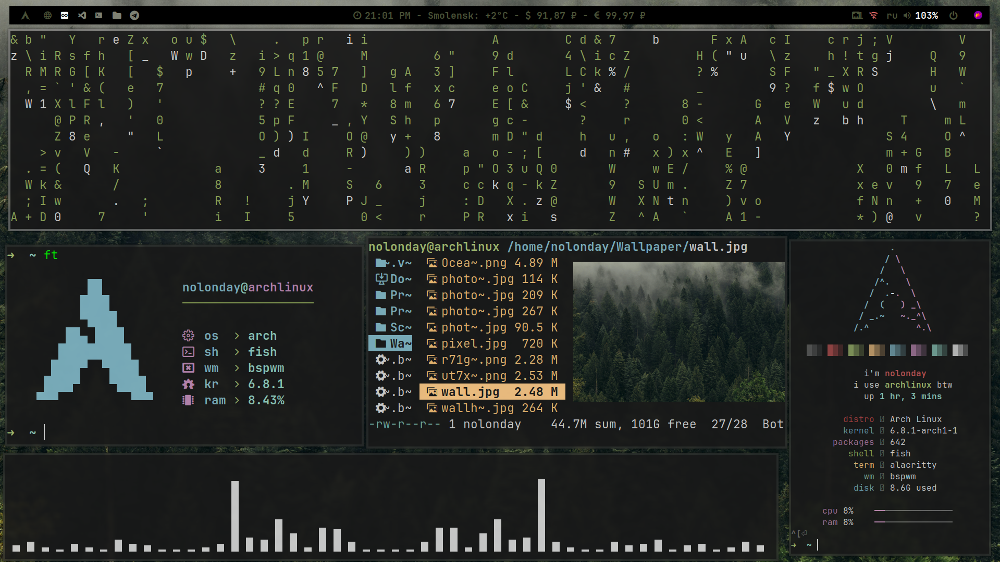
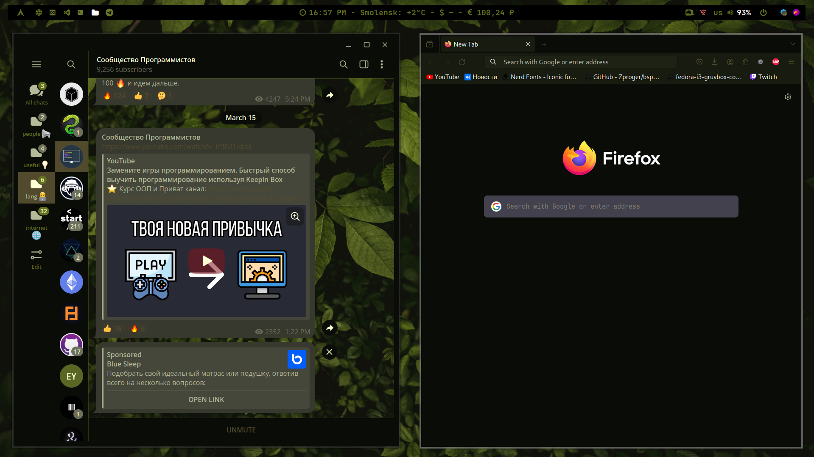

🌿BSPWM - ARCH🌿

  ✅OS:Arch Linux
  
  ✅WM:BSPWM
  
  ✅Bar:Polybar
  
  ✅Compositor:Picom
  
  ✅Terminal:Alacritty
  
  ✅App Launcher:Rofi
  
  ✅Notify Daemon:Dunst
  
  ✅Shell:Fish

Example photo

Example photo

